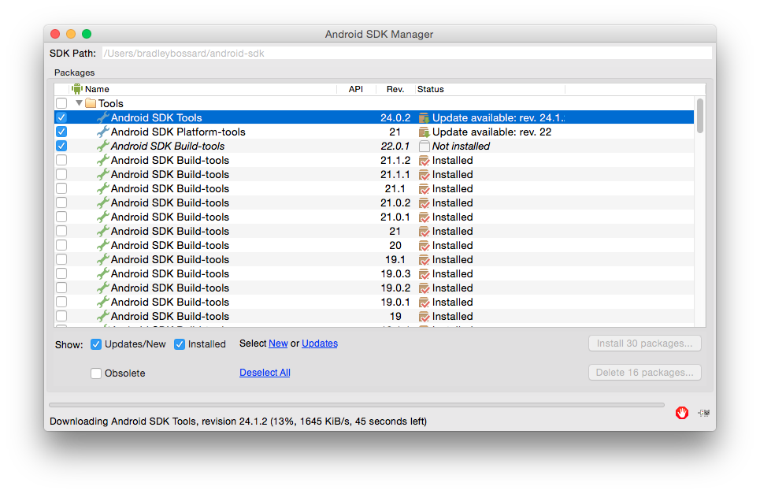

# android-basic-app-from-commandline

## purpose
I've written several Android apps, but I started Android development using early,
alpha versions of Android Studio.  I ran across an old tutorial today that uses
all command line tools for Android dev, and thought it would be fun to check it out.

## creating an android app from scratch using the cli (command-line) tools

1.  Install the Android SDK

Make sure you have the Android SDK downloaded and installed.  I won't go into too
much detail, but the general jist of it is, you need to download the SDK, put it in a
directory (I think something like ~/android-sdk is suggested), and then put the Android
SDK ~/android-sdk/tools and ~/android-sdk/platform-tools directory in your environment PATH.
Typically, on a Mac or Linux machine, this would be done by adding the following lines

    export ANDROID_HOME=~/android-sdk
    export PATH=$ANDROID_HOME/tools:$ANDROID_HOME/platform-tools::$PATH

to your ~/.bashrc file, or on a Mac, your ~/.profile file.  After you add the lines, you'll need
to reload the file into your environment using

    source ~/.bashrc

or

    source ~/.profile

2. List your available Android targets

The Android SDK (at the time of this writing is at version 21) is being continously upgraded to support major releases of Android (i.e. Gingerbread, Honeycomb, ICS, Jellybean, Lollipop) as well as interiem maintenance releases.  To see a list of all the targets you currently have installed, type

    android list targets  # This can output a ton of info

or

    android list targets | grep id:  # Produces just a list of available target names.

From this list, you want to select the highest value you currently have installed.  If you don't have any installed or need to upgrade, you can just type

    android

docimages/android-create-project.gif

docimages/android-list-target.png

docimages//android-show-targets.gif

which will open the Android SDK manager where you can select API versions and tools to install.

